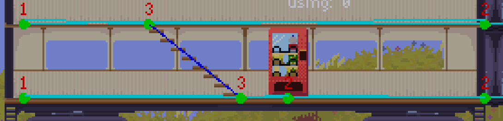
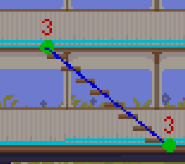

## A bit of backstory on the project

I am making a game where you build up a hotel on a train. You get customers at each stop and they will use the things you place down. Each customer will get a room that only they (or their party) can go into. You can also place stuff in their rooms.

## The quick answer 

You might be wondering how pathfinding works in this game. I had to write a custom pathfinding solution since Godot does not support side-view pathfinding. The solution is actually quite simple. There is a pathfinding network made up of a bunch of connected nodes. Each NPC can navigate between nodes using the [Dijkstra algorithm](https://en.wikipedia.org/wiki/Dijkstra's_algorithm)

## So how do I have public and private rooms?

Nodes (the points that can be pathfinded to) have a property telling the game if it's a public or a private node. If it's private they will also have an allow list that saves all the allowed NPCs that can use it. If an NPC tries to pathfind to (or through) a private node that doesnt have it whitelisted then the pathfinder will fail. In this case the inside door node is whitelisted so people can still walk past the room, but only specific NPCS can come in the room. This is enough to make sure everyone else stays out and is flexible enough for me to allow for inviting friends over or whatever if such a feature is needed in the future.

## Some more detail

Pathfinding typically begins in one of two ways: either an NPC is wandering, or it is attempting to complete a task. When wandering, the NPC simply chooses a random point and attempts to pathfind to it.

{}
In the future I plan to rework this so that wandering uses a much simpler pathfinding solution because right now if the random point that is picked is in a room they can’t access; it will compute the path, fail, pick a new point, and keep doing this until it finds an ok point to go to. In the future, I plan to try adding some sort of noise to control how they move without any real pathfinding which should be way less expensive to compute.
{}

When an NPC starts a task it probably needs to go somewhere. For example, if an NPC needs the bathroom it will search for the closest bathrooms and then rank them by how busy they are to try to avoid long lines. This encourages players to place more bathrooms to even out long lines. After a bathroom (or other buildable) is picked it will use the [Dijkstra algorithm](https://en.wikipedia.org/wiki/Dijkstra's_algorithm) to precompute the path it needs to take. Then it will slowly make its way there, and once there, its pathfinding will be done and the buildable will likely take over control of the NPC. In the case of the bathroom, the buildable will put them in line. If there is no line then they turn invisible (to the player it looks like they went inside of the bathroom) and then the bathroom does the rest of its job.

## How are new nodes linked?

When building new buildables its nodes are usually linked automatically. Each buildable has a pathfinding node on it so it will try to automatically register itself into the network and then find which 2 nodes it's between. After finding these 2 nodes, it will cut them apart so they are no longer linked. After that, it will link them to itself and vice versa (it’s a 2-way link. Yes this pathfinding system supports 1-way pathfinding but the auto registering doesn’t support it). For most buildables that’s the end of it, but there is 1 thing that breaks this: Stairs. Unlike every other buildable, it is not a buildable that will be used by the task system, and has 2 pathfinding nodes (A top and bottom node).

This is almost the same case as previously but I had to manually register the nodes since the auto register would unlink the 2. It’s also one of the few cases where 3 links will occur(which isnt supported by the auto-linking). It’s also the only case in my game where pathfinding goes up or down vertically so it’s marked a darker blue to signify that. For now, this doesn’t do much but could be used to trigger a custom walk animation, sound, or something else. On the topic of special nodes there is also a teleport node (which is used to link the outside of doors to the inside of doors which just teleports the npc from 1 node to the other since really the inside of the room is far under the rest of the train)

### Edge cases

What happens when a node is deleted that an NPC is going to pathfind to? Its pathfinding will fail. This used to crash the game but now it shouldn't. If this happens it will fail the task and start over trying to find a new path there. If it was between points it would first navigate to the nearest point and then continue to pathfind.

## Debugging

As you can see in the screenshot above, I have built some visual tools to help figure out how nodes are linked. This helped a great deal to ensure they were all linked right.

## Future optimizations 

For example, right now when NPCs are looking for a bathroom, they will look for the nearest one that isn’t too crowded. This sounds good on paper but if every room has a private bathroom in it, then it will try and fail many times before it finds a bathroom it can actually pathfind to. This is bad, especially if many NPCs do this since its very slow and causes lag. Originally I had this problem with beds too. In the future, I want to make it so that buildable pathfinding nodes will add themselves to a public list if they are in a public space. If they are not in a public space they won't be added. When an NPC needs to go to the bathroom, it will consider everything in the public list along with everything in any private rooms it has access to.