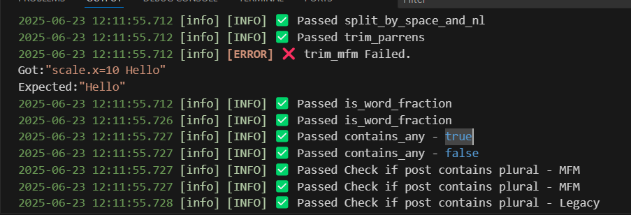

Since the [last time I talked about this](https://blog.leahdevs.xyz/p/making-your-first-misskey-plugin/) a lot has changed. We finally have decent [English documentation](https://aiscript-dev.github.io/en/references/syntax.html) and the language has received various updates. One thing that has stayed the same are the pains of Misskey plugin development. I'm talking about the fact that when you write a plugin it has to be contained in 1 file. Also as my [Pronoun Plugin](https://github.com/ChaoticLeah/pronoun-plugin) got bigger and bigger with more features I wanted to start unit testing it to avoid bugs but AIscript doesn't support this either. Another major issue for anyone working on any Misskey plugins is the fact that for every little change it can be a whole long process to test it which I also fixed.

So what did I do about this? I wrote a [plugin for visual studio code](https://github.com/ChaoticLeah/aiscript-tools) You can get it from the [marketplace](https://marketplace.visualstudio.com/items?itemName=Leah.aiscript-tools) too but right now the market place doesn't have everything the GitHub has. This plugin will hopefully help those who write Misskey plugins and if enough people enjoy it I plan to eventually move it to a CLI tool so it can do more and not just be visual studio code dependent. 

## Imports
This plugin implements imports. This lets you split up your plugin into multiple files - And you should because this will help a lot with the next feature. Splitting it up into multiple files helps a lot with organization. To do this the syntax is to just `#include <file.is>`. You can also do relative paths `#include <misc/test.is>`. What this does is close to the C Include: It just copies and pastes what's in that file where the include is. This does mean you need to take care to ensure you don't import things twice, get into circular dependency issues, or name 2 global variables or functions the same thing. To avoid this I've found its best to use [namespaces](https://aiscript-dev.github.io/en/references/syntax.html#namespace) to split up functionality so there are fewer global variable names to keep from conflicting.

## Live reloading
Plugin development can be a huge pain since you need to usually copy out the plugin code, go to your instance, paste it in, accept permissions, delete the old one, and so on. It's a lot, and very annoying when you want to test a lot or make a small tweak to something. Live reloading watching your base directory for changes, compiling the plugin to 1 file, and also live reloading your plugin in the browser using Pupeteer. Another feature of live reloading is it will try to pipe any prints back to your console in vscode.
### Limitations
- It only works in a chrome based browser for now
- You need to manually install  your plugin the first time
- The plugin you are working on also has to be manually installed on the first plugin slot as it will attempt to overwrite this (If you need to test it with other plugins put other plugins after your plugin)
- If you make any changes to the metadata of your plugin (adding settings or something else) you will need to also manually re-add it
- Sometimes piping the console doesn't pipe back errors. If you are confused it's still worth checking the browser's console
## Unit Testing
When your plugin gets big chances are you want to unit test it. Remember how I said it's best to split up your files? You should split all the logic functions from the main file so that you can test these core functions.
### Writing a test
Writing a test is easy. Make an AIscript file and import your logic functions file at the top. A super basic test will look like this:
```c
Test:expect("Does 1 + 1 equal 2?", 1 + 1).toEqual(2)
```
`Test:expect` takes in a string to describe the test, and then the second thing is where you would usually call the function you want to test. The `toEqual` bit tests to make sure that it's equal to the parameter you pass in. More realistically you might have something like this since you won't be testing if math is working:
```c
Test:expect("Check if post contains plural - MFM", PluralTools:is_post_plural("Hello World Posted by $[scale.hm Leah]")).toEqual(true)
```

Once you set up some tests and run them you will see something like this:


Unit tests will tell you when something has gone wrong and what it actually got and I think they are super helpful when you are writing a plugin that has gotten quite big to ensure future updates don't break the whole plugin in unexpected ways.

For now, there isn't anything more than just the toEqual function. Perhaps more will be added later for the future CLI tool.

#### Mocking missing globals
Since the unit tests are just running basic AIscript and not in a plugin environment you might need to mock some variables, functions, or APIs. For example, if your functions require some configs to be set then you will need to mock this up like so at the top of the test file:
```c
:: Plugin {
    let config = {
        pronoun_template: "%[name] (%[pronouns])",
        checkFields: true,
        //More stuff here
    }
}

//or

:: MK {
	@api(endpoint, payload) {
		//Fill in the mock API function here	
	}
}
```

This allows you to mock these variables in the config:
```c
/// @ 0.12.4

### {
  name: "Pronouns Plugin V4.4.9"
  version: "4.4.9"
  author: "@ChaosKitsune@woem.men"
  description: "This will try to put the user's pronouns in their name on any given post"
  permissions: ["read:account", "write:notifications"]
  config: {
        pronoun_template: {
            type: "string"
            label: "Pronoun template"
            description: 'Template for pronoun usernames. "%[name]" is replaced with the username.  "%[pronouns]" is replaced with the pronouns. '
            default: "%[name] (%[pronouns])"
        },
        checkFields: {
            type: 'boolean'
            label: 'Check User Fields (makes an extra API call)'
            description: 'If its crashing try disabling this'
            default: true
        },
        //More stuff here
```
You will also need to make mock functions if you interact with the API in any way such as `Mk:api`.

## Setup
{}
As of writing this the plugin isn't super polished since I plan to move away from the plugin soon anyway but it should still work quite well it just may have some weird quirks here or there that will be fixed in the CLI tool.
{}

- Install the plugin
- Press F1 and select `Generate AIscript Configuration`. This will put a `aiscript.json` in the root directory of the open project which will configure some things about how the plugin works.
- Configure the `aiscript.json`. Mine looks like [this.](https://github.com/ChaoticLeah/pronoun-plugin/blob/main/aiscript.json)
	- `baseUrl` is the URL of the instance you are testing on (This is relevant if you want live plugin reloading)
	- `endUrl` is for if you want it to end on `/notes/abcd` then put that. If it needs to go to `/explore` it will open up there
	- `pipeConsole` will pipe plugin relevant console things to your ide's console
	- `entry` is the entry point for the plugin. It's the main file.
	- `export` is where it will put the all-put-together plugin on live reload
### Live reloading setup
- Install a chrome or chrome-based browser
- From the command line run ``chrome --remote-debugging-port=9222 --no-sandbox --remote-allow-origins=*``
- Make sure you are logged into the instance and have manually installed your plugin on the first slot
- After that press F1 and run `Run AIScript plugin watcher`
- If everything worked it should open up on a new tab ready to live reload
### Unit Testing
- Make a test file
- Import the functions you will be testing (note to do so use relative paths like `#include <../src/tools.is>` if you are in `/tests/test.is`) Note: You can also import other tests if you want to split up your testing
- Mock any functions or variables you might need
- Write your tests
- Run them with `Unit test current AIscript file`

### Building your plugin
To build your plugin please follow the live reloading section as it will build the plugin. There is no separate process for this as of now.
### Extra info
Feel free to refer to the [pronoun plugins repo](https://github.com/ChaoticLeah/pronoun-plugin) to see how it's set up. Also, feel free to suggest things for this tool as there are some issues with it I'm trying to figure out like the fact that the testing domain is in the config file  (This is fine if everyone works on the same instance, but when someone is working on another instance and you are working together it can be a pain)

## Future plans for this
I plan to possibly move away from a Visual Studio plugin. I want to make a command line tool that will work between all IDEs. When I do this I'll likely write about it again. I want to make a package manager too, and eventually, I'd like to make a better system for imports. Right now it's basically just copy/pasting the code into 1 file where the includes are but this causes problems when variables have the same name or if you want to import something into 2 files.

### Will the CLI tool remain compatible with these projects
Yes, I plan to keep everything working as specified here. It's quite likely that the config JSON will move around quite a bit but if anything changes it shouldn't take super long to figure it out and get it all working again.