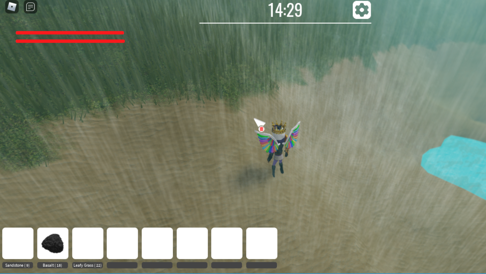
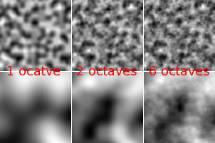
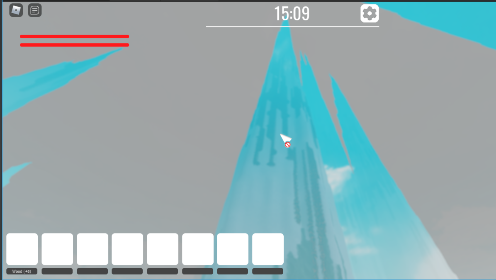
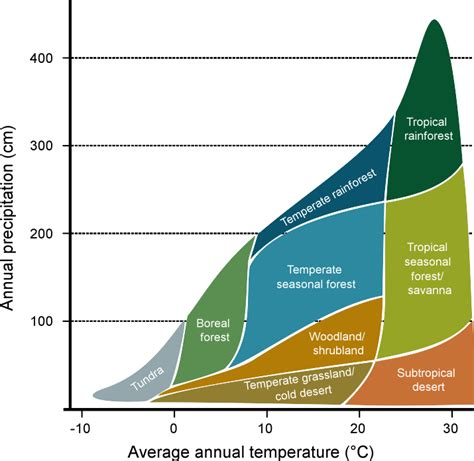
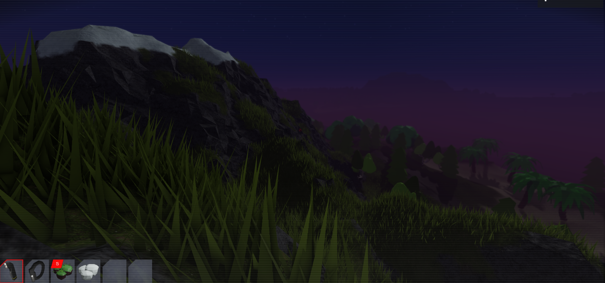
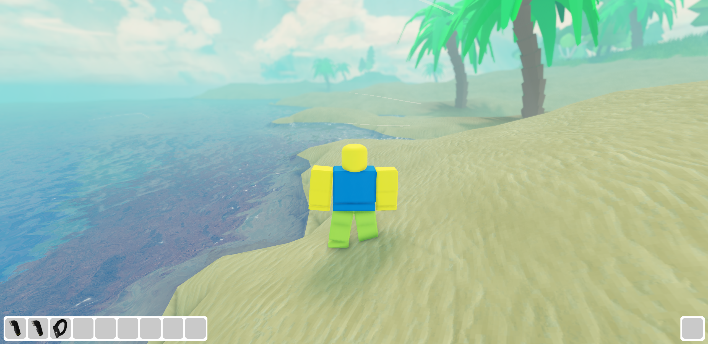
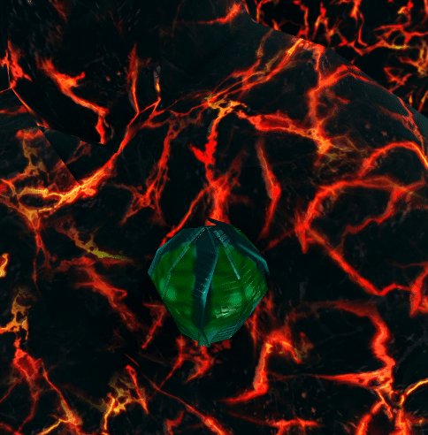
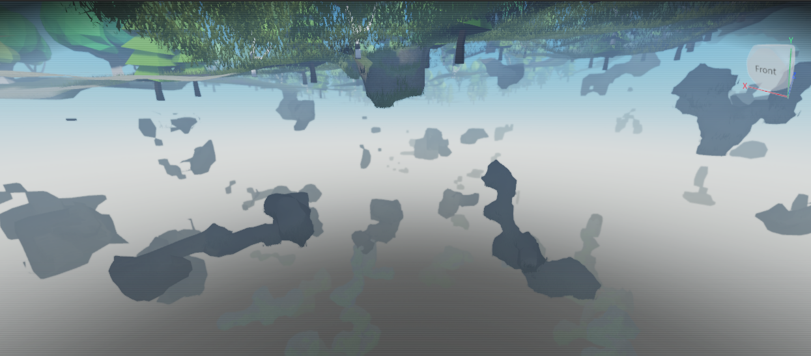
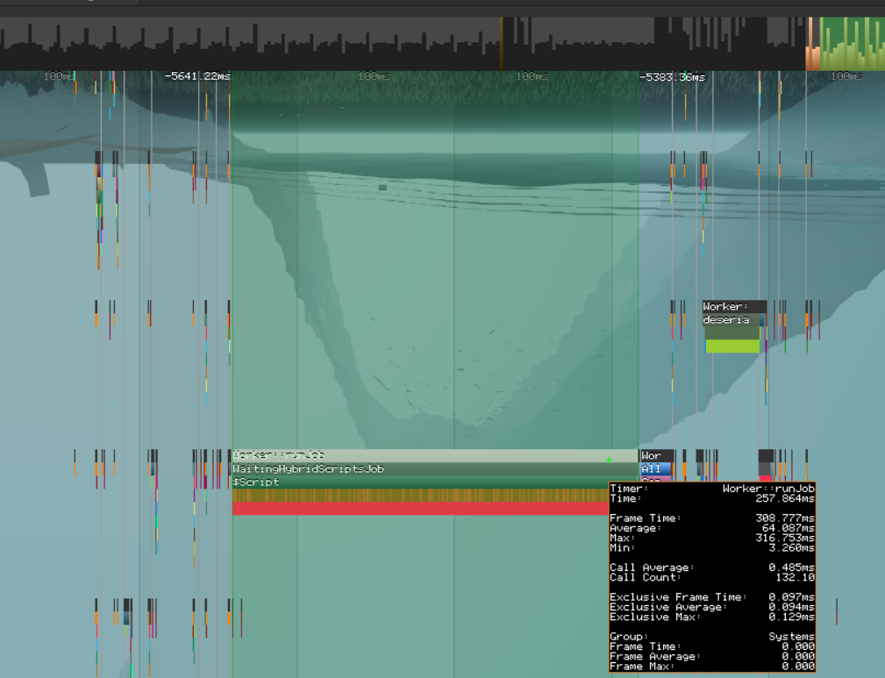

## Context

A while ago I was making a Roblox game that would generate an infinite sandbox world that you can build, destroy, and explore. I originally wanted to add survival and crafting and stuff like that but as of now none of these things are in the game.

### Will I continue the project?

I stopped working on this project due to Roblox's reputation for destroying games. I did want this to be a bigger thing, but mainly I wanted to see how far I could push Roblox.

It's possible I work on it here or there but I probably won't be fully returning to it. I've got other projects.

## Basic world generation

Basic world generation can be done with Perlin noise to generate a height map. This is quite simple but looks very similar everywhere you look.

To fix this we need to up the octaves. It's more work for the server but provides better results. Roblox does not provide a function to generate Perlin noise with octaves so we have to make our own. Still, at a distance, it looks very much the same. There are no biomes, no big flat lands, and no huge mountains. Cliffs are impossible like this too.

### Leveling up our world generation

So our world looks the same from a distance and can get boring quickly after wandering around for a while. What can we do about this?

#### Splines

World generation can be made more interesting with splines. If you want a more in-depth explanation of this I learned from [this talk](https://www.youtube.com/watch?v=ob3VwY4JyzE) explaining how Minecraft does it. Basically, we take our basic Perlin noise output and run it through a spline. This can transform many things including creating crazy mountains, flat valleys, and more. Alone this can give us crazy terrain, but still, at a distance it's very much the same.

##### Combining splines

In the talk, they talked about using 3 splines to simulate erosion and stuff like that. This can be done by generating 3 different Perlin noise values, running them through different splines, and then averaging them using weights that will allow us to control how much we want erosion to affect the final result, as well as the other 2 values.

## Biomes and materials

{}
Biomes in this system are not like actual biomes in the sense that each "biome" can only have 1 ground material. This is fine though since we can split what would be 1 biome into multiple sub-biomes which basically do the same thing.
{}

Ok so now we have interesting and varied terrain height generated that isn't too repetitive unless we really zoom far out, but we don't know what material to place where. For this, I made a "biome system" which allows me to specify each biomes elevation, slope, heat, rareness, moisture, material, and "spawnables". We will get back to spawnables later but for now, we have a list of biomes (aka materials) with parameters. Note: Parameters on biomes can be set to nil meaning "it doesn't matter what this is". We already have the height from the previous calculation so we can find the best fit for that but we need to do the rest now. With a few more perlin noisemaps we can generate the heat and moisture values. I chose heat and moisture as the primary factors for generation because, based on my research, these two variables play the biggest role in distinguishing different biomes.

So now we know the height, heat, and moisture, all we need now is to find the slope. Using simple math we can calculate the neighboring heights quickly and find the slope. With that, we can run through the biomes and calculate which biome fits the current chunk best, and then that material will be used in world generation.

{}
Chunks in this game are way smaller than Minecraft chunks so you do not notice jagged edges from materials blending. If the chunks were bigger that could be an issue.
{}

### An example

Mountains might be my favorite example of showing off all these systems. I researched mountains through many pictures to make my terrain system pretty accurate and generate pretty mountains. Mountains and slopes are made up of a few biomes: 
 - The grasslands
	 - This is mainly at the bottom of mountains and is just grassy
- The rocky grasslands
	- This is when the grasslands slopes up rapidly causing it to make a more rocky wall
- Mountains
	- This is just rock and occurs a bit up in the air when the slope is high
- Volcano Mountains
	- This occurs when its somewhat high up when the heat is maxed out. This just causes basalt to be placed
- Volcano Mountains Lava
	- This occurs at the peaks when the heat is maxed out. This just causes lava to be placed
- Snowy Mountains
	- Opposite of the Volcano Mountains this puts snow on the peaks when it's really cold
- Icey Mountains
	- If it's even colder, high up, and somewhat flat ice will spawn

All of this combined makes up the mountains and hills in this game, but in the code are counted as many biomes.

### What about the rest of the environment?

Trees and stuff are under the "spawnables" thing that I said we would get into later. Each spawnable has a rareness, a y-offset, and a model (which also includes any scripts needed for this spawnable) Then it just places them randomly in position and rotation while making sure the models down is facing the slope of the terrain so everything doesn't feel too straight and repetitive. This allows me to add treasure chests, trees, abandoned houses, any nature stuff, and much more.

## Caves

Ok, this Roblox server is already struggling to keep up but let's add caves into the mix because caves are cool! For this we will run some Perlin worms through the world that delete any terrain it comes in contact with (excluding water, if it comes in contact with water it stops). Doing this after it's all generated and when the server has time has the small downside of the player possibly seeing a cave appear but this doesn't usually happen, and for performance reasons, it would be hard to be done all at terrain generation time.

## Speeding things up

Right now there are many noise maps being calculated, splined, biomes are being sorted... a lot is going on for just a single chunk so how do we speed it up?

### Actors

Around the time when I had this all implemented Roblox added some sort of multithreading. This would be great if I could figure it out because the server is already struggling to keep up. It was quite confusing, but eventually, I threw world generation on another thread using Roblox's [Actor](https://create.roblox.com/docs/reference/engine/classes/Actor) system. Basically, it would generate chunks, and then send a message to the main thread to actually place the terrain since Actors cannot do this themselves due to thread safety and all that. I'm sure it helped but not as much as I hoped. I would love to split terrain generation into multiple threads but I still don't properly understand Actors, and doing this seems to require a lot of code duplication which I don't love.

### "Lazy for loops"

This is a thing I kind of invented (I'm sure someone else has come up with this concept before too) but before this, it would loop and generate all the needed chunks around the player using a for loop in 1 "server tick". If it had many chunks to make the whole server could slow down, and if it got bad the script could crash. My solution to this was what I call lazy for loops. The idea is you specify a maximum amount of time you want to let them do their looping, and if it goes over that it stops looping, saves whatever index it was at, and continues its job on the next cycle where it left off ensuring that it will never take too long and freeze everything.

### Fog

These Roblox servers im using can only do so much with such limited specs so I have to hide the edge of the world with fog and a bit of depth of field blur. 

## Chunk unloading

Chunks that have not been modified by the player will be unloaded if the server has some free time (when no players are near the chunk in question). If the server is overwhelmed with other stuff it will wait since unloading is also quite a lot of work for the server with deleting all the spawnables, and clearing all of the terrain in the chunk.

## Last few things

I have not mentioned it yet but this game has an ocean. This is easy since we just place a bunch of water and then the terrain generator overrides the bits of water with land if needed. Anything under the sea level will now have water in it.

If you want to test this game there are 2 versions. [Version 1](https://www.roblox.com/games/10101337094/Procedural-Game-Test) has building, and some things which version 2 doesnt have, and [Version 2](https://www.roblox.com/games/12519962736/Desolate-Dominion) has many changes, fixes, and other features. Version 2 is a full rewrite of the game.

If you thought this article was intresting I might be able to make one on the anticheat in this game so let me know.